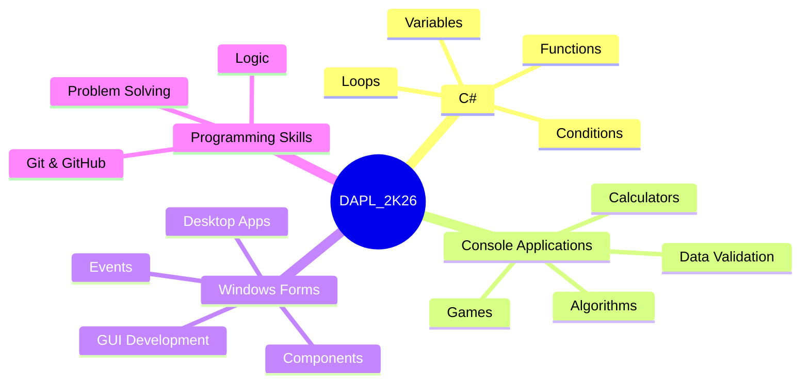
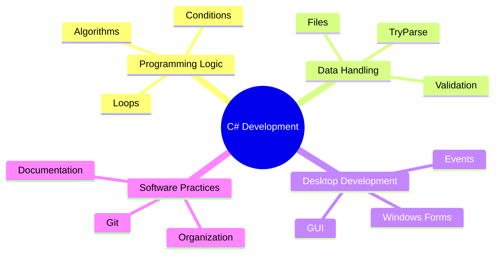

<div align="center">


<br>


<br>


</div>

---

# 👨‍💻 About the Repository

The **DAPL_2K26_P1** repository contains exercises and projects developed during the **Application Development** course of the **Technical Course in Systems Development** at **ETE FMC**.

The repository focuses on learning **C# programming**, covering console applications, data validation, algorithms and desktop applications using **Windows Forms**.

**Advisor: Prof. Daniel Mosca**

---

# 🗂️ Project Structure

```text
DAPL_2K26_P1/

│
├── LinguagemC#/
│   ├── Calculadora/
│   ├── Exercicios_Introducao/
│   ├── Lista_Exercicios/
│   └── Validacao/
│
├── WindowsForms/
│   ├── Cadastro2.0/
│   ├── Cadastro_forms/
│   ├── Instagram/
│   └── KikisCakes/
│
├── README.md
└── .gitignore
```

---

# 🏗️ Development Map



---

# 💻 C# Console Applications

Projects focused on programming fundamentals through terminal applications.

| Project | Description | Concepts |
|:---:|---|---|
| 🧮 Calculadora | Arithmetic operations and random calculations | Variables, operators, conditions |
| 📚 Exercicios Introdução | Initial programming exercises | Logic, loops and structures |
| 📝 Lista Exercícios | Collection of programming challenges | Algorithms and problem solving |
| ✅ Validação | User registration and input validation | TryParse, loops, validation rules |

---

# 🖥️ Windows Forms Applications

Desktop applications developed with **C# Windows Forms**, applying graphical interfaces and event-driven programming.

| Project | Description | Components |
|:---:|---|---|
| 📋 Cadastro | User registration interfaces | Forms, Labels, TextBoxes |
| 📱 Instagram | Interface simulation application | Forms, Images, Events |
| 🍰 KikisCakes | Food/product application prototype | GUI components |
| 🚚 Delivery App | Practical project under development | Images, Buttons, ListBox |

---

# 🚚 Practical Project — Delivery Application

Desktop application developed using **C# Windows Forms**, simulating a food delivery system.

### Main Features

- 🍔 Product visualization with images;
- 🛒 Adding items to the order;
- 📋 Order summary;
- 🎨 Custom visual identity;
- 🖥️ Single-screen interface.

### Technologies

| Technology | Usage |
|---|---|
| C# | Application logic |
| Windows Forms | Graphical interface |
| Visual Studio | Development environment |

> [!NOTE]
> The project is currently under development and will receive future improvements.

---

# 🎯 Learning Objectives



---

# 📈 Repository Status

> [!NOTE]
> This repository represents the first stage of development with C#, progressing from basic console applications to graphical desktop systems.

**Status:** 🟢 Active Development

---

<div align="center">


<br>

### Developed by

**Tuany Silva Pereira — 34DS**

**Technical Course in Systems Development**

**ETE FMC — 2026**

</div>
